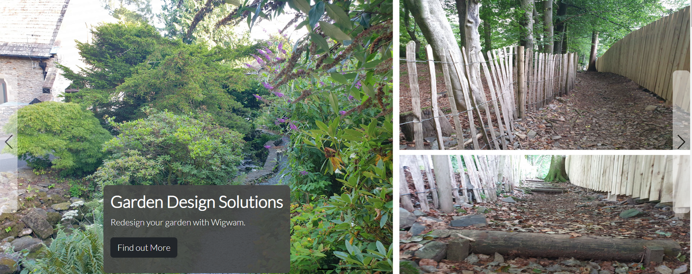
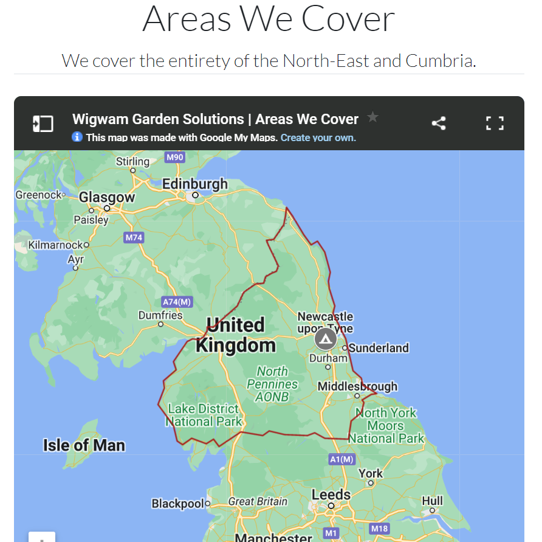

# README.md | Wigwam Garden Solutions
## (User Centric Front-End Development Project)

## Table of Contents
1. Introduction & Site Description
2. Instructions for running code in Gitpod
3. Content & Media
4. Deployment & Testing / Bugs
5. Acknowledgements

# Introduction & Site Description
(site description goes here)
A website to...
Aims of the website: 
- External User's Goal
- Site Owner's Goal 
- - Increase customer base
- Potential Features to include
- - Social media Links etc. 
- - Images and testimonials 

# Instructions
Instructions for running code in Gitpod

# Features
## Navigation Bar
The navigation bar is at positioned at the top of the screen across all site pages.
It is fully responsive and collapses into a navigation menu when viewed on mobile devices.
The navbar lets users navigate easily from page to page without having to press the back button.
The navigation links have a rollover effect to turn the link text from white to grey when the cursor hovers over them. This allows the user to easily select the desired link.
Additionally, the current page the user is viewing is indicated in the navbar by the link text turning a solid colour from the default white to grey.

## Footer

The footer is positioned at the bottom of each site page. Its function is to contain copyright information and provide social media links to Facebook, Instagram and Pinterest.

The grey line above the footer separates its involvement from the rest of the page and emphasises the end of the scrollable content.

## Image Carousel
The image carousel is the first thing the user will see when they visit the site. It's purpose is to tell the user about the company and showcase current features, promotions or recent projects through the use of photographic media and captions. The links within the captions hint to the user to explore different pages across the site to learn more information about the services on offer from Wigwam Garden Solutions.

The image carousel is fully responsive to fit all screen sizes. It is controlled via forward and back arrows and will autoscroll left to right but only after the user makes initial contact with the navigation buttons. 

## Recent Projects Gallery

The recent projects gallery showcases the company's recent work. It is a space for advertising the diverse range of services that they offer.

The images are fully responsive, showing as a 3x4 grid on desktop and displayed in a vertical stack on mobile.

The images all have a CSS applied zoom transition and the cursor has a rollover effect applied to show a zoom-in style cursor to encourage the user to click on them. Once clicked on, a modal appears showing a larger version of the image with a caption detailing the project and where it was done. 

The idea of this allow the user to explore ideas for a potential project their thinking of for themselves.

## Areas We Cover

This section contains an interactive iframe from Google Maps. It is a custom map that highlights the boundary of where the company covers.

The iframe is fully responsive and allows the user to drag, zoom and open the map in a new tab for better viewing. 

## Testimonials
The testimonials section shows the user the trustability of the company.

There is a link to Google Reviews showing a 4.5 Star rating.

In future, the testimonials section will contain an interactive iframe from Google Reviews instead of html text. 

## UX

## UI

## Content & Media
Code taken from... https://
Images taken from... https://

## Deployment & Testing
Explain the testing process, fixing bugs, include screenshots/code snippets...
Explain responsiveness and browser compatibility
Use the W3C Validator and provide proof of validation
Use Lighthouse to check for accessability/usability 

- Expected
Site is expected to do X when user does Y
- Testing
Tested site by doing Y
- Result
The site did not respond due to A, B, C
or
The site acted as expected and did Y
- Fix
I did Z to the code because of D

## Acknowledgements

Code for gallery was taken from Static Images example shown on mdbootstrap.com

### Images:

<a href="https://www.freepik.com/free-photo/colorful-flower-garden_1273869.htm#query=garden&position=0&from_view=search&track=sph">Garden-1 Image by aopsan</a> on Freepik

<a href="https://www.freepik.com/free-photo/close-up-petrol-hedge-cutter-that-holding-afro-gardener_26767495.htm#query=gardener&position=20&from_view=search&track=sph">Hedgecutter Image by ArtPhoto_studio</a> on Freepik

<a href="https://www.freepik.com/free-photo/man-florist-working-green-house_21795137.htm#query=gardener&position=4&from_view=search&track=sph">Florist Image by senivpetro</a> on Freepik

<a href="https://www.freepik.com/free-photo/rural-morning-close-up-beautiful-bearded-caucasian-male-farmer-blue-t-shirt-black-pants-smiling-working-farm-picking-crop-doing-favorite-job_9696954.htm#query=gardener&position=9&from_view=search&track=sph">Matty Image by cookie_studio</a> on Freepik

<a href="https://www.freepik.com/free-photo/outdoor-shot-logger-having-rest-open-air-after-cutting-trees_15755920.htm#query=tree%20surgeon&position=4&from_view=search&track=ais">Ricky Image by user18526052</a> on Freepik

<a href="https://www.freepik.com/free-photo/man-cutting-grass-with-lawn-mover-back-yard_8828102.htm#query=lawnmower&position=1&from_view=search&track=sph">Lawnmowern Image by senivpetro</a> on Freepik

<a href="https://www.freepik.com/free-photo/woman-gardner-greenhouse_4410517.htm#query=female%20gardener&position=40&from_view=search&track=ais">Nicole Image by senivpetro</a> on Freepik

Turf Photo by Anna Shvets from Pexels: https://www.pexels.com/photo/crop-worker-laying-grass-roll-5231236/

<a href="https://www.freepik.com/free-photo/empty-wood-chair_1272911.htm#query=garden%20decking&position=20&from_view=keyword&track=ais">Decking Image by topntp26</a> on Freepik

<a href="https://www.freepik.com/free-photo/close-up-coffee-table-with-two-colleague_9960699.htm#query=meeting%20coffee&position=0&from_view=search&track=ais">Meeting Image by lookstudio</a> on Freepik

<a href="https://www.freepik.com/free-photo/new-building-project_5400347.htm#query=construction%20survey&position=17&from_view=search&track=ais">Survey Image by pressfoto</a> on Freepik

Garden Plan Image by <a href="https://www.freepik.com/free-photo/crop-hands-using-template-stencil_2091845.htm#query=garden%20plan&position=47&from_view=search&track=ais">Freepik</a>

Tools Image by <a href="https://www.freepik.com/free-photo/arrangement-yellow-tools-with-copy-space_6413394.htm#query=tools&position=31&from_view=search&track=sph">Freepik</a>

<a href="https://www.freepik.com/free-photo/part-male-construction-worker_11230034.htm#query=tools&position=39&from_view=search&track=sph"> Tradie Image by gpointstudio</a> on Freepik

Planting Image by <a href="https://www.freepik.com/free-photo/overhead-view-hand-holding-small-fresh-potted-plant_2586588.htm#query=gardening&position=5&from_view=search&track=sph">Freepik</a>

<a href="https://www.freepik.com/free-photo/happy-young-family-during-picking-apples-garden-outdoors_7652653.htm#page=2&query=family%20garden%20relaxing&position=8&from_view=search&track=ais">Family Image by master1305</a> on Freepik

Constructing Image by <a href="https://www.freepik.com/free-photo/carpenter-man-taking-measures-wood-plank_11106766.htm#query=screwing%20fence&position=35&from_view=search&track=ais">Freepik</a>

<a href="https://www.freepik.com/free-photo/green-houseplant-background-plant-lovers_17599271.htm#query=garden%20concept&position=20&from_view=search&track=ais">Moodboard Image by rawpixel.com</a> on Freepik

<a href="https://www.freepik.com/free-photo/top-view-artificial-grass-soccer-field-background-texture_7810030.htm#query=grass&position=10&from_view=search&track=sph">Grass Image by jcomp</a> on Freepik

<a href="https://www.freepik.com/free-photo/incognito-man-cutting-overgrown-bushes_26767885.htm#query=hedge%20cutter&position=9&from_view=search&track=ais">Pruning Image by ArtPhoto_studio</a> on Freepik

Award-1 Image by <a href="https://pixabay.com/users/openclipart-vectors-30363/?utm_source=link-attribution&amp;utm_medium=referral&amp;utm_campaign=image&amp;utm_content=156160">OpenClipart-Vectors</a> from <a href="https://pixabay.com//?utm_source=link-attribution&amp;utm_medium=referral&amp;utm_campaign=image&amp;utm_content=156160">Pixabay</a>

<a href="https://www.freepik.com/free-vector/trophy_34295225.htm#query=trophy&position=3&from_view=search&track=sph">Trophy Image by juicy_fish</a> on Freepik

<a href="https://www.freepik.com/free-photo/close-up-strong-man-gloves-cutting-leaves-his-garden-farmer-spending-summer-morning-working-garden-near-countryside-house_9696898.htm#query=gardener&position=3&from_view=search&track=sph">Pruning-2 Image by cookie_studio</a> on Freepik