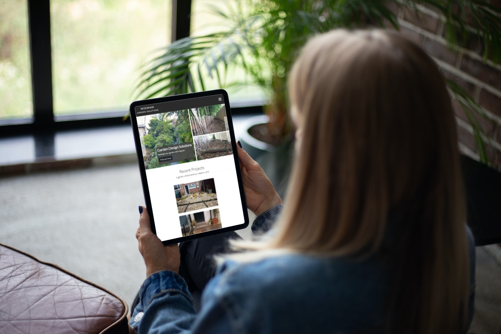

<h1>Wigwam Garden Solutions</h1>

<h2>A User-Centric Frontend Development Project</h2>
<h2>by Oscar Parkin-Christie</h2>

# Contents

1. [Introduction & Site Description](#introduction--site-description) 
2. [Instructions for running the code in Gitpod]()
3. [Mockups](#mockups)
4. [Design Choices](#design-choices)
5. [UX](#ux)
6. [UI](#ui)
7. [Site Features](#features)
8. [Future Features](#future-features)
9. [Testing & Deployment](#testing--deployment)
10. [Acknowledgements](#acknowledgements)

# Introduction & Site Description
This website is for Wigwam Garden Solutions, a garden design and landscaping company. The site... 

### Disclaimer
The example company, organisation, products, email addresses, contact information, logos, social media links, people, places and events herein are fictitious.
No association with any real company is intended nor should be inferred.

The example is for the sole purpose of showcasing my project for the User Centric Frontend Development Module for the Level 5 Diploma in Web Applications Development.

# Instructions
Instructions for running code in Gitpod

# Mockups

    
    

## Desktop

## Tablet

## Mobile

# Design Choices

The site has been laid out on a Bootstrap grid system. This presents contents and information in an intuitive way and makes it easy to digest. The grid system also allows for full responsiveness across all devices. 

The site's colour scheme is monochrome: black, white and grey.
The background is white to give it a clean, minimalist appearance and to make the content easy and accessible to read.

The navigation bar is a dark charcoal grey to make it stand out from other elements on the page. It also makes it obvious to the user that this is the navigation bar containing links to other pages.

The body text is black to make it accessible and easy to read. 
The page body's font is 'Lato' which is an easy to read sans-serif font.

The logo and navbar elements' colour is white and the font is 'Nunito Sans' in all caps with a CSS letter-spacing property set to 2px. This makes it easy to read and denotes each block of text as a separate navigation link. 
Each navlink as well as the logo has a CSS hover transition applied to turn the link from white to a light grey. This tells the user that this is a call to action. The link will remain the grey colour once clicked (link-active) to tell the user which page they are on.
The navlinks have padding applied to space them equidistant from one another and a 'text-center' property applied to center the navlinks on larger screen sizes. On smaller screen sizes, (tablets and mobiles), the navbar collapses and displays the links in a vertical menu. 

The site's images are displayed in rounded rectangles using Bootstrap's 'rounded-3' class attribute. This makes it easier on the eyes and more aesthetically pleasing than sharp corners. The images on the site are all of uniform proportions and this creates a consistent theme. 
The exceptions to this is on the 'Why Choose Us?' section where circular images are used instead of rounded rectangles. This is to denote focal points of interest. Each photo serves to represent one bullet point for reasons why the user should choose this company. 
Similarly, on the 'Meet The Team' section, circular images are favoured to denote profile pictures for each member of the team. 

Buttons on the site are taken from Bootstrap's library and are a dark charcoal grey colour (btn-dark) which has a CSS hover effect applied, turning it to a lighter shade of grey. This tells the user that this is a call to action. 

# Features
## Site-Wide Features

### Navigation Bar
The navigation bar is at positioned at the top of the screen across all site pages.
It is fully responsive and collapses into a navigation menu when viewed on mobile devices.
The navbar lets users navigate easily from page to page without having to press the back button.
The navigation links have a rollover effect to turn the link text from white to grey when the cursor hovers over them. This allows the user to easily select the desired link.
Additionally, the current page the user is viewing is indicated in the navbar by the link text turning a solid colour from the default white to grey.

### Footer

The footer is positioned at the bottom of each site page. Its function is to contain copyright information and provide social media links to Facebook, Instagram and Pinterest.

The grey line above the footer separates its involvement from the rest of the page and emphasises the end of the scrollable content.

## Home Page Features

### Image Carousel
The image carousel is the first thing the user will see when they visit the site. On desktop it fills the entire viewport. It's purpose is to tell the user about the company and showcase current features, promotions or recent projects through the use of photographic media and captions. The links within the captions hint to the user to explore different pages across the site to learn more information about the services on offer from Wigwam Garden Solutions.

The image carousel is fully responsive to fit all screen sizes. It is controlled with navigation arrows (forward and back). On page-loading, it will be static. However, once the user makes contact with the navigation arrows, it will begin to autoscroll through the images left to right. 

### Recent Projects Gallery

The recent projects gallery showcases the company's recent work. It is a space for advertising the diverse range of services that they offer and to encourage the user to explore ideas for a potential project they might have in mind.

The images are fully responsive, showing as a 3x4 Bootstrap grid on desktop and displayed in a vertical stack on mobile.

#### Desktop View

#### Mobile View

The images all have a CSS applied zoom transition on hover as well as the cursor which changes from a pointer to a zoom-in style cursor to encourage the user to click on them.

#### See The CSS Transition in Action:

Once clicked on, a Bootstrap lg modal appears showing a larger version of the image with a caption detailing the project and the location where it was done. 

### Image Modal

### Video Modal

### Areas We Cover

This section contains an interactive iframe from Google Maps. It is a custom map that highlights the boundary of where the company covers. It also has the company's office located as a custom pin on the map.

The iframe is fully responsive and allows the user to drag, zoom and open the map in a new tab for better viewing. 

### Testimonials
The testimonials section shows the user the trustability of the company.

There is a link to Google Reviews showing a 4.5 Star rating.

## 'Our Services' Page Features
All the images on the services page have Bootstrap's 'rounded-3' class attributed to them. They are all uniform in size in keeping with the site's theme.
The images are displayed in a Bootstrap grid with three rows of two columns on desktop and one column with six rows on mobile.

#### Desktop View

#### Mobile View

### Lawn Maintenance & Pricing Plans

The Weekly Lawn Maintenance feature is the main feature of the services page.
The user is asked a rhetorical question: 'Garden becoming a bit of a jungle?' to plant the idea that they can fix the situation by purchasing one of the service plans. 

The pricing is displayed using Bootstrap cards. This tells the user that these are products & services up for purchase and allows them to compare side by side, the included services of each plan to decide which is best for them. 

The 'Pro' pricing is displayed with a dark background. This is to make it stand out and convey to the user that this is a premium service. 

The 'Pro' pricing features the price in small, strikethrough text next to regular text ( <s>£50</s>  £40). This shows a limited time offer and urges the user to get in touch today to get a good deal on their service plan.

### Garden Redesigns

Below the list of services, is the Garden Redesigns section.
This is the area of expertise that Wigwam specialise in and are reknowned for. 
This section is placed below the list of services and is separated using a top-border to serve as a horizontal rule. This is because it is a specialist service reserved for customers who are looking for more than simple odd-jobs and light construction. It is for complete garden makeovers and big jobs.

This section utilises a Bootstrap collapse to hide large amounts of information. This streamlines the look of the page and improves UX. 
By default, when the page loads, this section is hidden. When the user presses the button, the section collapses to reveal the information. 

#### See the Collapse in Action:

### Redesigns by Wigwam <i>- Collapsed</i>

This section contains the seven steps of a Wigwam garden redesign.
The steps are layed out using a Bootstrap grid system comprised of rows and columns. 
On desktop view, there are two columns and two items per row. Step 7-Completion, is an exception and is positioned in the center of the screen to signal to the user that they have reached the end of this section. There are four rows in total. 

On mobile devices, this shrinks to one column or one item per row stacked on top of one another.

The items are read left to right, top to bottom similar to a comic strip and are intuitive, easy to follow and easy to digest.
Text content is minimal so as not to bore the user with unnecessary detail. 

Each step is numbered 1-7 with a circular styled number. These act like bullet points and provide a consistent style and a point of reference for the user.

Again, like the rest of the site, the images are styled with a CSS rollover zoom transition and have the Bootstrap 'rounded-3' attribute applied for consistency. 

At the end of the section, there is a 'Back to Top' button which when pressed automatically scrolls back to the top of the section without the user having to manually scroll all the way back up.
Having this button improves UX and adds interactivity and user control to the site.

In future, the button that triggers the collapse will include JavaScript components to make it more obvious to the user that this is a collapsable section. An example of this might include a caret-right or chevron-right icon on or next to the button that rotates when clicked becoming something resembling a caret-down or chevron-down icon. 

### Why Choose Us?

The 'Why Choose Us?' section aims to tell the user why a Wigwam garden redesign is better than the rest. It features three circular images, each serving to represent one bullet point.
"The three P's" (Professional, Personal & Permaculture) are a simple and memorable way of getting the main points across to the user. 

The word 'permaculture' is hyperlinked and left with default hyperlink styling to make it obvious to the user that this is a link. The reason for this is that most users will not understand what the word means or the significance of it in the context of garden design. 
When clicked, it opens an article from 'Permaculture Magazine' in a new tab giving more explanation as to its definition as well as providing access to the 'Permaculture Magazine' site. From there, they can explore articles and learn more.
Wigwam Garden Solutions use permaculture substantially within their designs. It is one of the company's core values and it is important to them to spread the word and educate as many people as possible to its benefits. 

## About Us Page Features

### Logo & Awards Image

The logo is positioned above the awards the company has won. This instills confidence in the company and showcases their achievements. 

### About Us Paragraph
This paragraph of text tells the user about the company and what it stands for. It focuses its content around sustainable design- one of the company's core values. It is important to Wigwam that this message is made clear to customers. 

### Meet The Team Section

The 'Meet The Team' section tells the user more about the team behind the company and the roles within it.

The button to Nicole's pinterest portfolio allows users to view her previous work and saved pins. It also provides inspiration to customers about how they would like their garden to look. 

## Free Quote Page Features

### Form

The Free Quote page contains a form where users can submit a request for a free quote.
There is also the opportunity for users to add any comments or questions they might have.
They can also upload multiple photos of their garden for Wigwam to better see the size of the job and the work required.

### Contact Info
At the bottom of the page is also all the company's contact info. This is displayed in a single row of four columns on desktop, and a single column of four rows on mobile. 
The email link is left with default hyperlink styling to tell the user that this is a link. When clicked, opens the user's default email client to send an email to Wigwam's email address. 
The social media links open each site in a new tab respectively. 

#### Desktop View:

#### Mobile View:

# Future Features
## JavaScript
In future, the site will include JavaScript components to add animations to certain elements such as the navbar navlinks.

## User Sign In & Loyalty Scheme
There will also be a page where users can create an account  where they can manage their bookings and earn loyalty points from their weekly lawn maintenance to unlock discounts. 

# UX
## Site Goals

The goal of the 'Wigwam Garden Solutions' website is to showcase the company's recent work as its portfolio and to increase the customer base.
It should tell the user about the company, its values and what services they offer.

The company is primarily focused on garden design so the site should have a large section dedicated to explaining the process the user can expect should they enquire about this service.

There should be a page with contact information for users to get in touch regarding a quote or question.
The site should include links to social media profiles for users to be able to share content with others and for the company to advertise its services and post more content such as images, videos, promotions and reviews. 

There should be a a section dedicated to testimonials for users to read reviews and gain understanding of the company's trustworthiness. 

The site should be easy to navigate, simple in its design and aesthetically pleasing.
The site should look good both on desktop and on mobile devices. 
The navbar should be responsive and should collapse when viewed on mobile devices.

The site should have a consistent colour scheme. Text content must use fonts that are consistent across all pages. Images and icons must be styled consistently.

Site administrators should be able to easily update information such as the Recent Projects gallery with new images or videos and keep the content up to date and relevant. 

## User Stories

### As a Customer:
- I want to quickly gain a sense of the company's identity and what they stand for. I want to know more about the company, its history and the people that make it up. 
- I want to be able to view the content I want and navigate the site with ease. All the links should work and take me to where I need to go.
- I want to see what services are on offer and if possible a rough price range.
- I want to see images or videos of their recent work.
- I want to be able to access their social media pages from this site.
- I want to see if I can trust this company, so reviews and testimonials must be included.
- I want to be able to contact the company if I have any questions or want to request a call back for a quote. All contact information (telephone, email, address and social media) must be available. I also want the option to be able to send over photos of my garden to ask them for their ideas on how to improve it. 
- I want to know if the company will be able to serve me, i.e. if I am in range of the areas that they cover. 
- I want to know why I should choose this company over any others and what makes them stand out from the crowd.
- If I am interested in getting my garden redesigned, I want to know what the process is involved in doing so.

### As the site Administrator:
- I want to increase customer base by advertising a wide range of services on offer.
- I want to include links to social media platforms where the company can advertise their services to a wider demographic.
- I want to be able to easily update the home page carousel with new content such as promotions.
- I want to be able to easily update the Recent Projects gallery with new content as soon as it becomes available. 
- I want to be able to easily update the Testimonials section with new up to date reviews.
- I want to be able to easily update the pricing on the Lawn Maintenance section to include limited time offers and changes in pricing.
- I also want to be able to easily update the services on offer if the company decide to specialise in other areas. 
- I want to be able to easily update the awards the company has won if they are nominated for other prizes in the future.
- I also want to be able to easily update the Meet The Team section in case the company decides to hire more staff.
- I want contact information to be accessible and clearly displayed so customers can easily get in touch regarding any questions or if they would like to request a quote. 
- I want to be able to collect data from the form into a database which emails each request to the company to ask for a quote or call back. I want this data to be managed securely and in line with GDPR data protection regulations.  
- I want to be able to keep the workings of this site up to date and compatible with a range of web browsers and devices by utilising version control effectively.

## Wireframes & Site Map
Wireframes for this site can be accessed: [here](/documents/wireframes.pdf)

A Site Map can be accessed: [here](/documents/site-map.pdf)

# UI
The user interface comprises of a navbar to quickly navigate from page to page without the user having to press the browser's back button.

# Testing & Deployment
## Manual Testing
Explain the testing process, fixing bugs, include screenshots/code snippets...
Explain responsiveness and browser compatibility
Use the W3C Validator and provide proof of validation
Use Lighthouse to check for accessability/usability 

- Expected
Site is expected to do X when user does Y
- Testing
Tested site by doing Y
- Result
The site did not respond due to A, B, C
or
The site acted as expected and did Y
- Fix
I did Z to the code because of D
s
<table>
<tr>
<td>Feature</td>
<td>Expectation</td>
<td>Result</td>
</tr>
<tr>
<td>Navbar</td>
<td>When </td>
</tr>
</table>

## Automated Testing

## [WC3 HTML Markup Validator](https://validator.w3.org/)

### index.html
The Home Page (index.html) passed the W3C HTML Validation Check with: NO ERRORS.

### services.html
The Our Services Page (services.html) passed the W3C HTML Validation Check with: NO ERRORS.

### about.html
The About Us Page (about.html) passed the W3C HTML Validation Check with: NO ERRORS.

### contact.html
The Free Quote / Contact Us Page (contact.html) passed the W3C HTML Validation Check with: NO ERRORS.

## [W3C Jigsaw CSS Validator](https://jigsaw.w3.org/css-validator/)

### style.css

The stylesheet (style.css) passed the W3C CSS Jigsaw Validation Check with: NO ERRORS.

# Bugs

## 1) Bug Found: 11/05/2023 18:30pm

The bug found was that the image (constructing.jpg) on the page was cut off at the bottom and not cropped to fit the container. Because of this, it didn't match the style consistent with the rest of the images on this page and across the site. 

The CSS applied to the image was:

### Bug Fixed: 12/05/2023 11:45am

The bug was fixed by adding a new style rule to the CSS targeting the image within the container. This made sure any image with this style rule applied, matched the size of the continer (div).

The style rule was updated to include this:

This resulted in the bug with said image being fixed:

## 2) Bug Found: 12/05/2023 12:10pm

The bug found was that the image (moss-min.jpg) was ever so slightly, not aligned square with image above, and so stands out and is not consistent with the style of the rest of the images on the page. 

After fault-finding this didn't appear to be an issue with the CSS but rather the HTML.
The HTML was:

166 | `<section class="container-fluid pb-4 my-3 border-top" id="see-more">`

### Bug Fixed: 12/05/2023 12:15pm

The bug was fixed by removing the Bootstrap ("container-fluid") class attribute from the section.
The HTML is now:

166 | `<section class="pb-4 my-3 border-top" id="see-more">`

This resulted in the bug being fixed:

## 3) Bug Found: 15/05/2023 09:30am

The bug found was that the social media links located in the footer across the site, as well as the Contact Us section on (services.html) and in Nicole's bio on the Meet The Team section (about.html) only link to the homepage of each site. (e.g. facebook.com, instagram.com, pinterest.com). 

### ! THIS BUG REMAINS TO BE FIXED ! 
This is because a social media profile has not yet been set up for the company. In future these links will take the user to the company's profile page on each social media platform.

## 4) Bug Found: 15/05/2023 09:30am

The bug found was that the link to Google Reviews in the Testimonials section on (index.html) only links to Google's homepage (google.com) instead of the company's profile on Google Reviews.

### ! THIS BUG REMAINS TO BE FIXED ! 
This is because a profile has not yet been set up for the company on Google Maps and Google Reviews. In future this link will take the customer to the company's Google Reviews profile.  

## 5) Bug Found: 15/05/2023 13:35pm

The bug found was that the page did not fit the screen responsively and caused an overflow on the x-axis. This resulted in a horizontal scroll bar. This was particularly noticeable when viewed on tablet and mobile.

### Bug Fixed: 16/05/2023 10:30am

The bug was fixed by adding the `"container-fluid p-0"` class attribute to the `<body>` and `<html>` tags of each page. This results in a responsive webpage without any white space (padding) added by Bootstrap.
The horizontal scroll bar was removed by adding a CSS style rule to the `"container-fluid"` class attribute: `"overflow-x: hidden"`.

The website is now fully responsive across a range of viewports including mobile devices.

## 6) Bug Found: 16/05/2023 11:15am

On certain mobile devices, the image carousel caption on (index.html) was not resizing responsively causing the caption and its text to be cut off.

### Bug Fixed: 16/05/2023 11:30am

Thanks to help from a forum post on [Stack Overflow](https://stackoverflow.com/questions/55198646/bootstrap-carousel-caption-not-responsive-html-css). I was able to fix the bug using media queries to target the font size of the text within the carousel caption for each of Bootstrap's default breakpoints.
Doing this makes it fully responsive across all screen sizes.

This resulted in the bug being fixed:

## 7) Bug Found: 16/05/2023 11:35am

The bug found was that on certain screen sizes when viewed on a mobile device, the images in the recent projects gallery were not evenly spaced and had been cut off.

### Bug Fixed 16/05/2023  12:00pm

The bug was fixed by adding the `"img-fluid"` Bootstrap class attribute to the parent div of the ``. Left and right padding was also added to all `` elements in the gallery section using Bootstrap's `"px-2"` class attribute.

This resulted in the bug being fixed:

# Automated Testing

Tested on selenium.dev

Tested on W3C HTML Validator

Tested on Jigsaw CSS Validator

# Acknowledgements
## This website was built using [Bootstrap](https://getbootstrap.com/) v5.3.

## The icons on this site were taken from [FontAwesome](https://fontawesome.com/) v6.4.0.
They are listed below in alphabetical order:

- [building](https://fontawesome.com/icons/building?f=classic&s=solid)
- [campground](https://fontawesome.com/icons/campground?f=classic&s=solid)
- [chevron-up](https://fontawesome.com/icons/chevron-up?f=classic&s=solid)
- [envelope](https://fontawesome.com/icons/envelope?f=classic&s=solid)
- [facebook](https://fontawesome.com/icons/facebook?f=brands&s=solid)
- [hashtag](https://fontawesome.com/icons/hashtag?f=classic&s=solid)
- [instagram](https://fontawesome.com/icons/instagram?f=brands&s=solid)
- [list](https://fontawesome.com/icons/list?f=classic&s=solid)
- [location-dot](https://fontawesome.com/icons/location-dot?f=classic&s=solid)
- [martini-glass-citrus](https://fontawesome.com/icons/martini-glass-citrus?f=classic&s=solid)
- [pen-to-square](https://fontawesome.com/icons/pen-to-square?f=classic&s=solid)
- [people-group](https://fontawesome.com/icons/people-group?f=classic&s=solid)
- [phone](https://fontawesome.com/icons/phone?f=classic&s=solid)
- [pinterest](https://fontawesome.com/icons/pinterest?f=brands&s=solid) 
- [star](https://fontawesome.com/icons/star?f=classic&s=solid)
- [star-half-stroke](https://fontawesome.com/icons/star-half-stroke?f=classic&s=regular)
- [trowel](https://fontawesome.com/icons/trowel?f=classic&s=solid)
- [user](https://fontawesome.com/icons/user?f=classic&s=solid)

## The fonts used on this site are taken from [Google Fonts](https://fonts.google.com/). 
They are:
- [Nunito Sans](https://fonts.google.com/specimen/Nunito+Sans?query=nunito+sans) (Designed by Vernon Adams, Jacques Le Bailly, Manvel Shmavonyan, Alexei Vanyashin)
- [Lato](https://fonts.google.com/specimen/Lato?query=lato) (Designed by Łukasz Dziedzic)

## Images:

All images & videos on this site are my own unless specified otherwise below:

- [award-1.png](https://pixabay.com/vectors/laurel-wreath-roman-victory-black-156019/)
by OpenClipart-Vectors on Pixabay

- [award-2.jpg](https://www.freepik.com/free-vector/trophy_34295225.htm#query=trophy&position=3&from_view=search&track=sph)
by juicy_fish on Freepik

- [constructing.jpg](https://www.freepik.com/free-photo/carpenter-man-taking-measures-wood-plank_11106766.htm#query=screwing%20fence&position=35&from_view=search&track=ais)
by freepik on Freepik

- [decking-2.jpg](https://www.freepik.com/free-photo/empty-wood-chair_1272911.htm#query=garden%20decking&position=20&from_view=keyword&track=ais)
by topntp26 on Freepik

- [family.jpg](https://www.freepik.com/free-photo/happy-young-family-during-picking-apples-garden-outdoors_7652653.htm#page=2&query=family%20garden%20relaxing&position=8&from_view=search&track=ais)
by master1305 on Freepik

- [florist.jpg](https://www.freepik.com/free-photo/man-florist-working-green-house_21795137.htm#query=gardener&position=4&from_view=search&track=sph)
by senivpetro on Freepik

- [garden-plan.jpg](https://www.freepik.com/free-photo/crop-hands-using-template-stencil_2091845.htm#query=garden%20plan&position=47&from_view=search&track=ais)
by freepik on Freepik

- [lawnmower-min.jpg](https://www.freepik.com/free-photo/man-cutting-grass-with-lawn-mover-back-yard_8828102.htm#query=lawnmower&position=1&from_view=search&track=sph)
by senivpetro on Freepik

- [matty.jpg](https://www.freepik.com/free-photo/rural-morning-close-up-beautiful-bearded-caucasian-male-farmer-blue-t-shirt-black-pants-smiling-working-farm-picking-crop-doing-favorite-job_9696954.htm#query=gardener&position=9&from_view=search&track=sph)
by cookie_studio on Freepik

- [meeting.jpg](https://www.freepik.com/free-photo/close-up-coffee-table-with-two-colleague_9960699.htm#query=meeting%20coffee&position=0&from_view=search&track=ais)
by lookstudio on Freepik

- [moodboard.jpg](https://www.freepik.com/free-photo/green-houseplant-background-plant-lovers_17599271.htm#query=garden%20concept&position=20&from_view=search&track=ais)
by rawpixel.com on Freepik

- [nicole.jpg](https://www.freepik.com/free-photo/woman-gardner-greenhouse_4410517.htm#query=female%20gardener&position=40&from_view=search&track=ais)
by senivpetro on Freepik

- [planting.jpg](https://www.freepik.com/free-photo/overhead-view-hand-holding-small-fresh-potted-plant_2586588.htm#query=gardening&position=5&from_view=search&track=sph)
by freepik on Freepik

- [pruning.jpg](https://www.freepik.com/free-photo/incognito-man-cutting-overgrown-bushes_26767885.htm#query=hedge%20cutter&position=9&from_view=search&track=ais)
by Artphoto_studio on Freepik

- [ricky.jpg](https://www.freepik.com/free-photo/outdoor-shot-logger-having-rest-open-air-after-cutting-trees_15755920.htm#query=tree%20surgeon&position=4&from_view=search&track=ais)
by user18526052 on Freepik

- [survey.jpg](https://www.freepik.com/free-photo/new-building-project_5400347.htm#query=construction%20survey&position=17&from_view=search&track=ais)
by pressfoto on Freepik

- [tradie.jpg](https://www.freepik.com/free-photo/part-male-construction-worker_11230034.htm#query=tools&position=39&from_view=search&track=sph)
by gpointstudio on Freepik

## The mockups featured in the README.md file were taken from [SmartMockups](https://smartmockups.com/). 

The templates are for which are listed below:

- [African-American man using MacBook Pro](https://smartmockups.com/mockup/AA9AevNjIn5)
- [iPad Pro in the hands of a woman sitting on the couch beside the window](https://smartmockups.com/mockup/tU%24lNMrEV)
- [Sony Xperia 1 IV](https://smartmockups.com/mockup/YWH6sUgmkY5)
- [Studio Display](https://smartmockups.com/mockup/KEyIVr5llKC)
- [Tablet](https://smartmockups.com/mockup/7dCMjVzUCJm)

